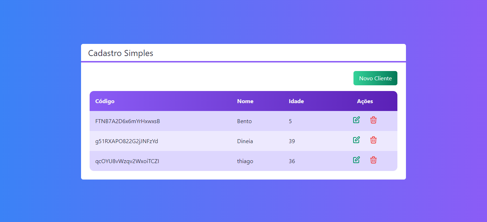
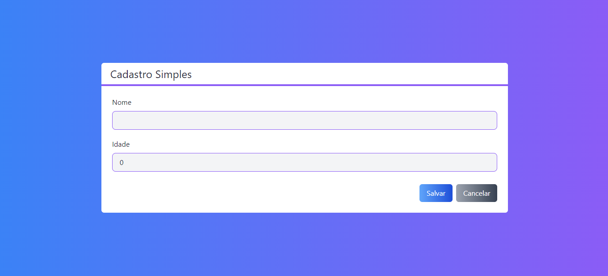
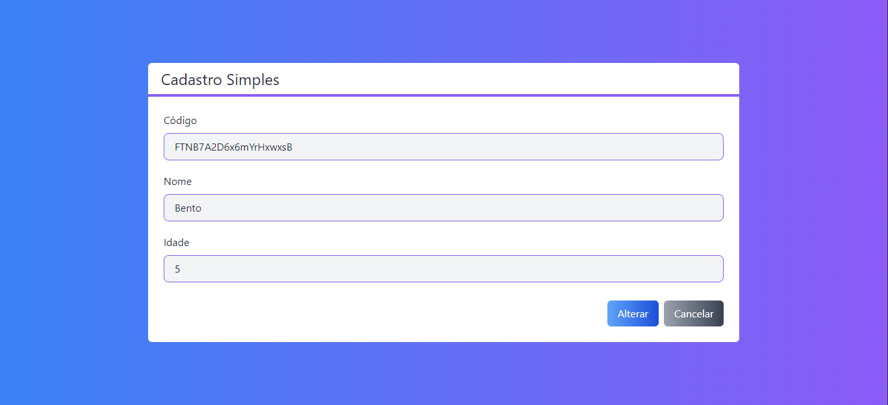

# Projeto para cadastros simples, todo desenvolvido com nextjs

### Sistema simples que vai fazer as 4 operações de um CRUD.

### Dentro do <b>README</b> da pasta do projeto está tudo que foi ou está sendo usando:

https://github.com/thiagoadssilva/YoutubeNextJsReactCod3r/blob/main/next-crud/README.md

## Projeto Publicado: Não foi publicado

## Imagem do projeto

